# 🏥 WaitLess CHU - Comprehensive UML Documentation

## 📊 Project Overview
WaitLess CHU is a smart hospital queue management system with QR code technology, real-time updates, and multi-role user management.

---

## 1. 👥 Use Case Diagram


---

## 2. 🗂️ Class Diagram - Data Models

```mermaid
classDiagram
    class User {
        +int id
        +string email
        +string hashed_password
        +string full_name
        +string phone
        +UserRole role
        +int assigned_service_id
        +bool is_active
        +datetime created_at
        +datetime updated_at
        +List~Ticket~ tickets
        +Service assigned_service
    }
    
    class Service {
        +int id
        +string name
        +string description
        +string location
        +int max_wait_time
        +ServicePriority priority
        +ServiceStatus status
        +int current_waiting
        +int avg_wait_time
        +datetime created_at
        +datetime updated_at
        +List~Ticket~ tickets
    }
    
    class Ticket {
        +int id
        +string ticket_number
        +int patient_id
        +int service_id
        +TicketStatus status
        +ServicePriority priority
        +int position_in_queue
        +int estimated_wait_time
        +string qr_code
        +string notes
        +datetime estimated_arrival
        +datetime actual_arrival
        +datetime consultation_start
        +datetime consultation_end
        +datetime created_at
        +datetime updated_at
        +User patient
        +Service service
    }
    
    class QueueLog {
        +int id
        +int ticket_id
        +string action
        +datetime timestamp
        +string details
        +Ticket ticket
    }
    
    class Alert {
        +int id
        +string type
        +string message
        +int service_id
        +bool is_read
        +datetime created_at
        +Service service
    }
    
    %% Enums
    class UserRole {
        <<enumeration>>
        PATIENT
        ADMIN
        STAFF
        DOCTOR
    }
    
    class ServicePriority {
        <<enumeration>>
        LOW
        MEDIUM
        HIGH
    }
    
    class ServiceStatus {
        <<enumeration>>
        ACTIVE
        INACTIVE
        EMERGENCY
    }
    
    class TicketStatus {
        <<enumeration>>
        WAITING
        CONSULTING
        COMPLETED
        CANCELLED
        EXPIRED
    }
    
    %% Relationships
    User ||--o{ Ticket : creates
    User ||--o| Service : assigned_to
    Service ||--o{ Ticket : manages
    Ticket ||--o{ QueueLog : generates
    Service ||--o{ Alert : triggers
    
    User }o--|| UserRole : has
    Service }o--|| ServicePriority : has
    Service }o--|| ServiceStatus : has
    Ticket }o--|| TicketStatus : has
    Ticket }o--|| ServicePriority : has
```

---

## 3. 🏗️ System Architecture Diagram


---

## 4. 🔄 Sequence Diagram - Patient QR Journey


---

## 5. 🔄 Sequence Diagram - Staff Queue Management


---

## 6. 🔄 Activity Diagram - Queue Processing Flow


---

## 7. 🗄️ Database ERD (Entity Relationship Diagram)


---

## 8. 🚀 Deployment Diagram

```mermaid
graph TB
    subgraph "Client Devices"
        MOBILE[📱 Mobile Browsers<br/>QR Scanner + Tracking]
        DESKTOP[💻 Desktop Browsers<br/>Staff Dashboards]
        TABLET[📟 Tablets<br/>Doctor Interfaces]
    end
    
    subgraph "Load Balancer"
        LB[⚖️ NGINX<br/>Load Balancer + SSL]
    end
    
    subgraph "Application Servers"
        APP1[🐍 FastAPI Instance 1<br/>Port 8000]
        APP2[🐍 FastAPI Instance 2<br/>Port 8001]
        APP3[🐍 FastAPI Instance 3<br/>Port 8002]
    end
    
    subgraph "Database Cluster"
        PRIMARY[(🗄️ PostgreSQL Primary<br/>Read/Write)]
        REPLICA1[(🗄️ PostgreSQL Replica 1<br/>Read Only)]
        REPLICA2[(🗄️ PostgreSQL Replica 2<br/>Read Only)]
    end
    
    subgraph "Cache Layer"
        REDIS[📦 Redis Cache<br/>Session + Queue State]
    end
    
    subgraph "File Storage"
        STATIC[📁 Static Files<br/>QR Codes + Assets]
    end
    
    subgraph "Monitoring"
        LOGS[📊 Log Aggregation<br/>ELK Stack]
        METRICS[📈 Metrics<br/>Prometheus + Grafana]
    end
    
    %% Connections
    MOBILE --> LB
    DESKTOP --> LB
    TABLET --> LB
    
    LB --> APP1
    LB --> APP2
    LB --> APP3
    
    APP1 --> PRIMARY
    APP1 --> REPLICA1
    APP1 --> REDIS
    APP1 --> STATIC
    
    APP2 --> PRIMARY
    APP2 --> REPLICA2
    APP2 --> REDIS
    APP2 --> STATIC
    
    APP3 --> PRIMARY
    APP3 --> REPLICA1
    APP3 --> REDIS
    APP3 --> STATIC
    
    PRIMARY --> REPLICA1
    PRIMARY --> REPLICA2
    
    APP1 --> LOGS
    APP2 --> LOGS
    APP3 --> LOGS
    
    APP1 --> METRICS
    APP2 --> METRICS
    APP3 --> METRICS
```



---

## 9. 🔧 Component Diagram - Backend Services


---

## 10. 🔧 Component Diagram - Frontend Structure


---

## 11. 🔐 Security Architecture Diagram

```mermaid
graph TB
    subgraph "Authentication Flow"
        LOGIN[User Login] --> VALIDATE[Credential Validation]
        VALIDATE --> JWT_CREATE[JWT Token Creation]
        JWT_CREATE --> RESPONSE[Login Response]
    end
    
    subgraph "Authorization Layers"
        REQUEST[API Request] --> JWT_CHECK[JWT Validation]
        JWT_CHECK --> ROLE_CHECK[Role-Based Access]
        ROLE_CHECK --> PERMISSION[Permission Check]
        PERMISSION --> ACCESS[Grant/Deny Access]
    end
    
    subgraph "Security Components"
        BCRYPT[Password Hashing<br/>bcrypt]
        JWT_TOKEN[JWT Tokens<br/>jose library]
        CORS[CORS Middleware<br/>Cross-Origin Policy]
        RBAC[Role-Based Access Control<br/>Admin/Staff/Doctor/Patient]
    end
    
    subgraph "User Roles & Permissions"
        PATIENT_ROLE[👤 Patient<br/>- Join Queue<br/>- Track Status<br/>- View Own Tickets]
        STAFF_ROLE[👩‍💼 Staff<br/>- Manage Queue<br/>- View Reports<br/>- Handle Cancellations]
        DOCTOR_ROLE[👨‍⚕️ Doctor<br/>- Call Patients<br/>- Update Status<br/>- View Queue]
        ADMIN_ROLE[🛡️ Admin<br/>- Full System Access<br/>- User Management<br/>- System Config]
    end
    
    %% Connections
    VALIDATE --> BCRYPT
    JWT_CREATE --> JWT_TOKEN
    JWT_CHECK --> JWT_TOKEN
    ROLE_CHECK --> RBAC
    
    RBAC --> PATIENT_ROLE
    RBAC --> STAFF_ROLE
    RBAC --> DOCTOR_ROLE
    RBAC --> ADMIN_ROLE
```



---

## 12. 🔄 State Diagram - Ticket Lifecycle


---

## 📝 Summary

This comprehensive UML documentation covers all aspects of the WaitLess CHU system:

### 🎯 **Key Diagrams Created:**
1. **Use Case Diagram** - User interactions and system functions
2. **Class Diagram** - Data model structure and relationships
3. **System Architecture** - High-level system design
4. **Sequence Diagrams** - Patient journey and staff workflows
5. **Activity Diagram** - Queue processing flow
6. **Database ERD** - Data relationships and structure
7. **Deployment Diagram** - Infrastructure and scaling
8. **Component Diagrams** - Frontend and backend architecture
9. **Security Architecture** - Authentication and authorization
10. **State Diagram** - Ticket lifecycle management

### 🚀 **System Highlights:**
- **QR Code Integration** for contactless queue joining
- **Real-time Updates** via WebSocket connections
- **Role-based Access Control** for different user types
- **Scalable Architecture** with load balancing
- **Comprehensive Security** with JWT authentication
- **Modern Frontend** with responsive design
- **Database Optimization** for high concurrency

This documentation provides a complete technical overview for developers, architects, and stakeholders to understand the WaitLess CHU system design and implementation.